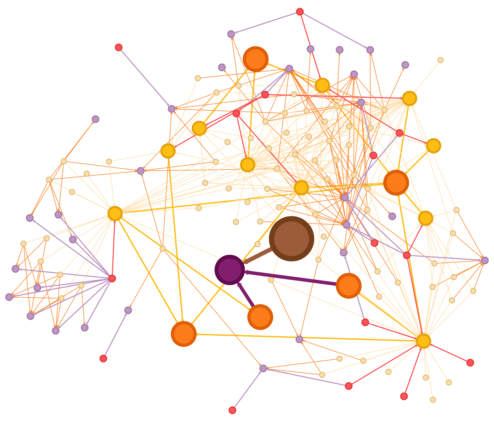
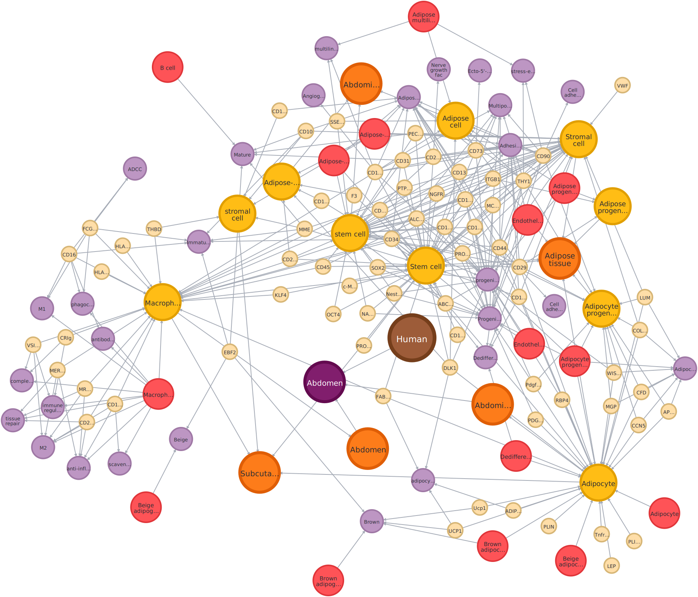
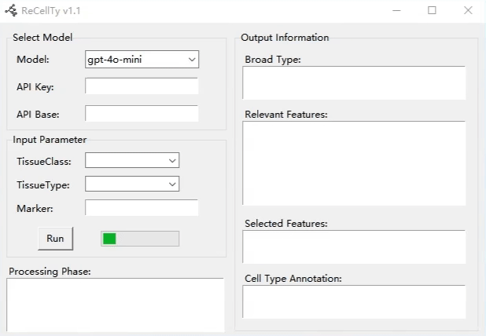

# Reconstructing cells from graph dataset: Retrieval-Augmented LLM workflow for cell type annotation
<p align="center">
  
  
</p>


This repository accompanies our research paper titled "[Reconstructing cells from graph dataset: Retrieval-Augmented LLM workflow for cell type annotation]()." 
It includes the core module for cell type annotation using graph datasets and Retrieval-Augmented LLMs. Below are the steps to set up the environment, retrieve graph data, and run the ReCellTy pipeline.


## 🛠️ Environment Setup

### 1. Create Conda Environment

```
conda create -n ReCellTy python=3.9 
conda activate ReCellTy
cd ReCellTy
```

### 2. Install Dependencies
```
pip install -r requirements.txt
```

### 3. Software Requirements

The version numbers used in our experiment are as follows:

| Software | Version | Download Link                                                                           |
|----------|---------|-----------------------------------------------------------------------------------------|
| Neo4j    | 4.4.38  | [Installation document](https://neo4j.com/docs/operations-manual/current/installation/) |
| java     | 11.0.1  | [Installation document](https://www.oracle.com/java/technologies/downloads/?er=221886)                                                         |

Other compliant versions also be accepted.

Follow the installation documentation to configure the relevant environment variables for the next steps.


## 🚀 Quick Start

### 1. Get graph database

#### 1.1. Define Neo4j credentials:
Configure the following three environment variables, or change your pass_word in the `construct_graph.py`,
 `ReCellTy_demo.py`, `UI.py`.
```
os.environ["NEO4J_URI"] = "bolt://localhost:7687"
os.environ["NEO4J_USERNAME"] = "neo4j"
os.environ["NEO4J_PASSWORD"] = "your_password"
```
#### 1.2. Connect graph dataset
Open the Neo4j image database:
```
%NEO4J_HOME%\bin\neo4j console
```

The interface can be opened in a web browser [http://localhost:7474](http://localhost:7474/) for interaction

Make sure your neo4j database is properly connected

Note: "Running Neo4j in the terminal will occupy one terminal window. Please open another terminal window to run the following steps, or run the code in your IDE.

#### 1.3. Construct graph dataset

Create graph database from cell feature-marker.csv:
```
python construct_graph.py
```


### 2. Use ReCellTy

#### 2.1. Method 1
Start with the example in `ReCellTy_demo.py`
```
python ReCellTy_demo.py
```
#### 2.2. Method 2
Run the `UI.py` file to launch the mini program. Below is an example.
```
python UI.py
```

<p align="center">

</div>


More methods and experiments can be found at [ReCellTy-paper](https://github.com/SSG2019/ReCellTy-paper)


